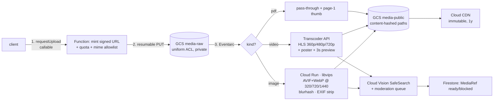

# Ayant (САН) — System Design

Status: **proposal** · Scope: all 28 product features · Target: 10k DAU today → 200k DAU without a rewrite
Last updated: 2026-08-06

Companion docs: [`san-points-system.md`](san-points-system.md) (money model), [`../security/app-check-rollout.md`](../security/app-check-rollout.md) (attestation).

---

## 0. TL;DR — the three things that decide whether this scales

1. **The workload is not QPS-bound. It is fan-out-bound.** At 200k DAU the peak is ~22 sessions/sec — nothing. But today *one* session reads the **entire** `venues` + `deals` + `reviews` collections ([`FirebaseServices.swift:117-139`](../../AyantData/Sources/AyantData/FirebaseServices.swift#L117)). At the 1000-business catalog that is ~168k document reads **per app open**, ≈ 50B reads/day, ≈ **$30k/day** in Firestore reads alone. This is the single existential item.
2. **Feed delivery must move from "query Firestore" to "fetch a CDN-cached, server-materialized bundle."** The existing architecture makes this cheap: `FeedBuilder`/`Ranking` are already pure and take an explicit `now` and an explicit `FeedCatalog` snapshot. Swap where the snapshot *comes from* and nothing in the domain, feature or UI layer changes.
3. **Once reads are fixed, cost is dominated by media egress**, not by the database. ~11.5 TB/month of image+video egress at 200k DAU. That is a CDN + encoding-ladder problem, and there is currently no derivative pipeline at all (`FileUploadService` stores the original as `.jpg` or `.pdf`; the admin panel uploads to an unsigned Cloudinary preset).

Everything below is the plan for those three, plus a per-feature pass over all 28.

---

## 1. Workload model

### 1.1 Traffic

| | Today | Stage A (10k DAU) | Stage B (200k DAU) |
|---|---|---|---|
| DAU | ~0 | 10 000 | 200 000 |
| Sessions/day (1.6/user) | — | 16 000 | 320 000 |
| Avg sessions/sec | — | 0.19 | 3.7 |
| **Peak sessions/sec** (×6, single timezone, lunch+dinner spikes) | — | **1.1** | **22** |
| Businesses | ~10 | 100 | 1 000 |
| Venues (branches counted) | 41 | ~300 | ~3 000 |
| Active deals (3–10/business) | ~50 | ~1 500 | ~15 000 |
| Reviews (cumulative) | ~100 | ~10 000 | ~150 000 |
| Media objects | ~100 | ~4 000 | ~50 000 |
| QR scans/day (money path) | ~0 | 2 000 | 60 000 |
| Telemetry events/day (~50/user) | — | 500 000 | 10 000 000 |

**Read this table twice.** 22 peak sessions/sec is a workload a single small server could serve from RAM. Every scaling problem in this system is self-inflicted read amplification, not user load. That is good news: all of it is fixable inside the current stack.

### 1.2 Shape of a session

A typical session: open app → feed (20–40 cards) → 1–2 venue details → maybe search → maybe a coupon/points action. Reads it *should* cost:

| Step | Target cost |
|---|---|
| Cold launch feed | 1 CDN GET (usually `304`) + 1 Firestore read (catalog version) |
| Warm launch feed | 0 network (local bundle) + background revalidate |
| Venue detail | 1 venue read (already in bundle) + 20 reviews page |
| Personal library (coupons, points, stamps, favourites) | ~10 reads, cached + snapshot-listened |
| Search | 1 search-service query (or 0, served from local bundle) |
| **Total** | **~35 Firestore reads/session** vs **~168 000 today** |

---

## 2. Where the current architecture breaks

Grounded in the code as it stands on `harden-backend-and-architecture`.

| # | Break | Where | Breaks at | Consequence |
|---|---|---|---|---|
| B1 | `fetchVenues()` reads the whole `venues` collection, unfiltered, unpaginated | [`FirebaseServices.swift:117`](../../AyantData/Sources/AyantData/FirebaseServices.swift#L117) | ~500 venues | Linear cost per session in catalog size |
| B2 | `fetchReviews()` reads the **whole `reviews` collection** on every cold launch | [`FirebaseServices.swift:139`](../../AyantData/Sources/AyantData/FirebaseServices.swift#L139) | ~5 000 reviews | Dominant read cost; grows forever, never pruned |
| B3 | `FeedStore.recombine()` is **O(venues × reviews)** — for each venue it filters the full review array | [`FeedStore.swift`](../../AyantFeatures/Sources/AyantFeatures/FeedStore.swift) `recombine()` | 300 venues × 10k reviews = 3M ops | Main-actor stall on launch; 450M ops at Stage B |
| B4 | No `citySlug` filter on any read; no `firestore.indexes.json` in the repo | `firebase.json` has no `firestore.indexes` key | multi-city launch | Every city pays for every other city; composite queries will fail at deploy time |
| B5 | Telemetry is **one Firestore doc + one Function invocation + one delete per event** | [`index.ts:325`](../../functions/src/index.ts#L325) `countAnalyticsEvent` | ~1M events/day | 10M writes + 10M invocations/day at Stage B; also a per-venue-per-day counter doc that will exceed the 1 write/sec sustained limit for popular venues |
| B6 | `sendPushCampaign` does a **sequential `pushLog/{token}` read per token** | [`index.ts:167`](../../functions/src/index.ts#L167) | ~20k tokens | Guaranteed 540s timeout; 200k reads per campaign; no checkpointing so a retry re-sends |
| B7 | Search is a client-side `filter` over the in-memory catalog | [`SearchView.swift:40`](../../SAN/SearchView.swift#L40) | ~2 000 venues | No relevance ranking, no typo tolerance, no geo query; bundle must hold everything |
| B8 | Two inconsistent media paths, no derivatives, no video | [`FileUploadService.kt`](../../android/data/src/main/kotlin/kg/ayant/app/data/FileUploadService.kt), `docs/admin/index.html:841` (unsigned Cloudinary preset) | first video, first slow network | Full-size originals over 3G; unsigned preset is an open write endpoint on your Cloudinary account |
| B9 | **Confirmed:** Firestore is in `nam5` (US multi-region), all Functions in `us-central1`, no region pinned in code | `functions/src/index.ts:31`, verified via CLI (§5.5) | now | ~230–280 ms RTT from Bishkek on every round trip, plus multi-region write consensus on the money path. **A database's location is immutable** — fix via a named in-project database before real traffic |
| B11 | **No Firebase Storage bucket is provisioned** — `FirebaseFileUploadService` calls `FirebaseStorage.getInstance()` and swallows the failure in `runCatching{}.getOrNull()` | [`FileUploadService.kt`](../../android/data/src/main/kotlin/kg/ayant/app/data/FileUploadService.kt) | now | App-side uploads have been failing silently and returning `null`; the only working media path is the admin panel's unsigned Cloudinary preset. Makes §4.4 a greenfield build rather than a migration |
| B10 | `venues.savedByCount` / `rating` incremented on a single doc | schema + rules | a viral venue | Firestore sustains ~1 write/sec per document |

None of these are architectural mistakes for a pre-launch app — full-collection reads over 41 venues are the *right* call at that size. They are all "correct until N".

---

## 3. Target architecture

```mermaid
flowchart TB
  subgraph clients[Clients]
    iOS[iOS · SwiftUI]
    AND[Android · Compose]
    ADM[Admin panel · web]
  end

  subgraph edge[Edge — Cloud CDN / Firebase Hosting]
    FB[feed bundles<br/>feed/{city}/{cat}/p0.json.br]
    CB[catalog bundles + deltas<br/>catalog/{city}/v{n}.json.br]
    MED[media derivatives<br/>AVIF/WebP · HLS]
  end

  subgraph svc[Stateful services]
    FS[(Firestore<br/>source of truth)]
    SRCH[Search · Typesense on Cloud Run]
    GCS[(GCS: media-raw / media-public)]
    BQ[(BigQuery<br/>events + ML training)]
  end

  subgraph fn[Cloud Functions / Run]
    MAT[bundle materializer<br/>scheduled + dirty-flag]
    MONEY[money path<br/>scanCoupon · redeemVenuePoints]
    TRANS[media transcode<br/>libvips · Transcoder API]
    PUSH[push orchestrator<br/>Pub/Sub fan-out]
    ROLL[rollups<br/>host metrics · reconcile]
  end

  iOS & AND --> FB & CB & MED
  iOS & AND -->|writes, personal reads| FS
  iOS & AND -->|batched events| ING[ingest endpoint] --> PS[(Pub/Sub)] --> BQ
  iOS & AND -->|QR scan| MONEY --> FS
  iOS & AND --> SRCH
  ADM --> FS
  FS --> MAT --> FB & CB
  FS --> SRCH
  GCS --> TRANS --> MED
  PS --> ROLL --> FS
  BQ --> ROLL
  PUSH --> FS
```

### The five load classes, and how each is served

| Class | Examples | Serving strategy | Why |
|---|---|---|---|
| **Public, shared, slowly-changing** | catalog, feed, categories, ranking weights, banners | **Materialized bundle on CDN**, versioned, brotli, immutable URLs | Same bytes for every user in a city → one origin fetch serves 200k users |
| **Personal, small, live** | coupons, points balance, stamps, favourites, profile | Firestore direct + snapshot listeners | Already correct today; per-user docs, no hot spots |
| **Transactional, money** | scan, redeem, referral, gift | Server-authoritative callables, idempotency keys, transactions | Already correct today; **do not touch the shape** |
| **High-volume, lossy, analytical** | impressions, clicks, ranking events, screen views | Batched HTTP → Pub/Sub → BigQuery; rollups back into Firestore | Loses the 10M writes/day; puts ML training data where it belongs |
| **Large binary** | photos, videos, banners, menu PDFs | Signed upload → GCS → transcode → CDN, `MediaRef` in Firestore | The only class where the cost is bytes, not operations |

**The invariant to hold onto:** *Firestore is the source of truth and the transaction engine. It is not the read path for shared content.*

---

## 4. Component designs

### 4.1 Catalog & feed delivery — the core change

#### Two tiers of bundle

**Tier 1 — feed page (the 95% path).** Server-materialized, ranked, per `(citySlug, category)`:

```
https://cdn.ayant.kg/feed/bishkek/all/p0.json?v=1893
https://cdn.ayant.kg/feed/bishkek/food/p0.json?v=1893
```

Contents: top ~200 ranked cards with everything needed to render — venue/deal fields, `MediaRef`s, ad slots already interleaved, plus the current `rankingWeights`. Size: ~200 items × 400 B lean ≈ 80 KB → **~18 KB brotli**. `Cache-Control: public, max-age=300, stale-while-revalidate=3600`, plus ETag → most launches are a `304`.

**Tier 2 — full catalog (search, map, offline).** All venues + active deals for the city, downloaded once and thereafter by delta:

```
catalog/bishkek/full-v1893.json.br      ~3 000 venues + 15 000 deals ≈ 900 KB brotli
catalog/bishkek/delta-1890-1893.json.br ~2–20 KB
```

Client keeps `localVersion`; if `remoteVersion - localVersion <= 20` it fetches deltas, otherwise a full refresh. Refreshed on launch in the background, never blocking the feed.

#### Version discovery

One tiny Firestore doc `config/catalogVersion` = `{ bishkek: 1893, ... }`, read once per launch (1 read), and also carried in Remote Config so a cold launch can skip Firestore entirely. Clients hold a snapshot listener on it while foregrounded → new deals appear within seconds without polling.

#### Materializer

A Cloud Function that rebuilds bundles:

- **Trigger:** `onDocumentWritten` on `venues/{id}`, `deals/{id}`, `config/rankingWeights` sets `catalogDirty.{city} = true`.
- **Build:** `onSchedule("every 2 minutes")` — if dirty, read the city's catalog once (one full-collection read *server-side*, ~18k docs → ~$0.01 per build, ~720 builds/day → **$7/day at Stage B, replacing $30k/day of client reads**), run the *same* `FeedBuilder` logic, write bundles to GCS, bump the version doc, clear the flag.
- **Ranking parity:** the materializer must produce the same ordering the client would. Port `Ranking`/`FeedBuilder` to TypeScript **or** — better — treat the bundle as an unranked *candidate set* (top 400 by a coarse server score) and let the client run the existing pure `FeedBuilder` over it. **Recommended: the second.** It keeps one implementation of ranking, keeps distance and `isOpen(at:)`/`isActive(at:)` on-device where the clock and the GPS actually are, and keeps the bundle per-city rather than per-user so it stays CDN-cacheable.

That last point is why this migration is cheap for you specifically: `FeedBuilder(catalog, now)` is already pure and time-injected. The client keeps calling it. Only `FeedStore.load()` changes — from three Firestore queries to one bundle fetch that produces the same `FeedCatalog`.

#### Consistency

Eventual, bounded at ~2 minutes for catalog changes. Acceptable for deals and venue edits. **Not** acceptable for: coupon state, points balance, stamp counts, moderation status seen by the host who just edited. Those stay on direct Firestore reads with listeners. A host editing their own venue sees their own edit immediately via the existing host overlay (`setHostContent`) — that mechanism already solves read-your-writes for the one case that needs it.

#### What this deletes

- `fetchVenues()` / `fetchDeals()` / `fetchReviews()` full-collection reads (B1, B2)
- The client-side `O(V×R)` review aggregation (B3) — aggregates are precomputed into the bundle
- The need for most composite indexes on the read path

---

### 4.2 Reviews

Reviews are the worst offender today and the easiest fix.

- **Aggregates denormalize onto the venue.** A Function on `reviews/{id}` write recomputes `rating`, `reviewCount`, and a `ratingHistogram[5]` onto `venues/{venueID}` (throttled: accumulate in a `reviewAgg/{venueID}` doc, flush every 60s, so a review burst doesn't hot-spot the venue doc). `ReviewStats.aggregate` stays in the domain and stays tested — it just runs server-side too, or the server writes what the domain computes.
- **Reads are paginated, per venue, on demand.** `reviews where venueID == X order by createdAt desc limit 20`, cursor-paginated. Never fetched for the feed.
- **The feed carries only `(rating, count)`** from the venue doc.
- **Moderation:** new reviews land `status: "pending"` if they trip a heuristic (links, first review from a <24h account, profanity list) → admin queue; otherwise `published` immediately. Host reply path unchanged.

Index required: `reviews (venueID ASC, createdAt DESC)`.

---

### 4.3 Search

Client-side filtering dies at ~2k venues, and it can never do typo tolerance or relevance — which matters a lot in a bilingual (ru/ky) market where users type «шаурма», «шаварма», «shaurma».

**Design:** Typesense (or Meilisearch) on Cloud Run, 1 instance, 2 vCPU / 4 GB. 3k venues + 15k deals is a ~50 MB index — it fits in memory with room for 100 cities.

- **Sync:** Firestore trigger → upsert/delete into the index. Backfill via the same materializer pass.
- **Schema:** `name`, `category`, `district`, `tags`, `menuItems[]`, `geo (lat,lng)`, `citySlug`, `rating`, `isVerified`, `boostedUntil`.
- **Query:** `q` + `filter_by: citySlug:=bishkek && category:=[...]` + `sort_by: _text_match:desc, rating:desc` + geo `sort_by: location(42.87,74.59):asc`.
- **Fallback:** if the search service is down or the user is offline, fall back to the existing local filter over the Tier-2 bundle. This is a real advantage of keeping the bundle — search degrades instead of failing.
- **Cost:** one `e2-small`-class Cloud Run instance, min-instances=1 → ~$25/month. Algolia at this volume would be ~$500+/month; not worth it until you need multi-region.

Map search uses the same index with a geo filter; the Maps SDK key issue is orthogonal (it's a client config problem, not architecture).

---

### 4.4 Media pipeline — images, video, banners

This is the largest *new* build, and the one the current code has least of.

#### Problems today
- Two upload paths (Firebase Storage from apps; **unsigned** Cloudinary preset from the admin panel — anyone who reads `docs/admin/index.html` can upload to your Cloudinary account, since `upload_preset: 'Ayta_ios'` and cloud name are in client source).
- No derivatives: the original 4 MB phone photo is what a user on 3G downloads.
- No video support at all (`FileUploadService` hardcodes `jpg`/`pdf`).
- URLs are stored as raw strings (`imageURL`, `imageURLs`) — no way to change format or CDN later without a data migration.

#### Target



#### `MediaRef` — the model change

Stop storing URLs. Store a reference; the client composes the URL.

```jsonc
// embedded in venues/{id}.media[], deals/{id}.media[], banners/{id}.asset
{
  "id": "m_7fa3c1",            // content hash
  "kind": "image" | "video" | "pdf",
  "aspect": 1.777,             // known before download → no layout shift
  "blurhash": "LEHV6nWB2yk8",  // instant placeholder
  "durationMs": 28400,         // video only
  "status": "ready" | "processing" | "blocked",
  "v": 2                       // derivative-set version
}
```

URL is derived: `https://cdn.ayant.kg/m/{id}/{width}.avif`, `.../hls/master.m3u8`. This means you can re-encode the entire library to a new format (JPEG XL, AV1) by bumping `v` and backfilling — no Firestore migration, no client release.

#### Format & ladder decisions

| Asset | Delivery | Rationale |
|---|---|---|
| Feed card image | AVIF 720w (~25 KB), WebP fallback, blurhash placeholder | 4–5× smaller than the current originals; both platforms decode AVIF (iOS 16+, Android 12+; WebP covers the rest) |
| Venue gallery | AVIF 1440w on tap | Lazy, not in the feed payload |
| Banner / ad creative | AVIF 1440w + a `safeArea` box in the ref so text isn't cropped across aspect ratios | Banners are the one asset where cropping is a business problem |
| Video | HLS, 3 renditions (360/480/720p), 2s segments, poster frame, autoplay muted from the 360p rung | Bishkek mobile networks vary a lot; adaptive start-low is the difference between "plays" and "spins" |
| Menu PDF | Pass-through + page-1 thumbnail | Already works; just needs the thumbnail |

**Do not autoplay video in the feed above 360p, and only on Wi-Fi/unmetered by default.** A 720p autoplay policy at 200k DAU is a ~4× egress bill.

#### Quotas & abuse
- Per-host upload quota: 50 images + 5 videos/day, 100 MB/video, enforced at signed-URL mint.
- MIME allowlist verified server-side after upload (magic bytes, not the client's claim).
- EXIF/GPS stripped on ingest (a venue photo carrying a staff member's home GPS is a real privacy incident).
- SafeSearch + a manual queue for anything flagged; `status: blocked` renders a placeholder, never a 404.

#### Cost at Stage B

| | Volume | Cost/month |
|---|---|---|
| Storage (raw + derivatives) | ~150 GB | ~$4 |
| Image egress (20 cards × 25 KB × 320k sessions) | ~4.8 TB | ~$390 (CDN @ $0.08/GB, 90% hit) |
| Video egress (10% sessions × 1 play × 2 MB) | ~1.9 TB | ~$155 |
| Transcode (50k images, 2k videos/mo) | — | ~$60 |
| **Total media** | | **~$610/month** |

That is the floor for infra cost at 200k DAU, and it is fine. The point of §4.1 is to make sure the database bill isn't 50× larger than this.

---

### 4.5 Telemetry, analytics & the ML loop

#### Current (B5)
`analyticsEvents/{id}` doc write → Function → increment `analytics/{venue}/days/{day}` → delete the event. Three Firestore ops + one invocation **per event**. `rankingEvents` is append-only doc-per-event with no TTL. At 10M events/day this is ~$60/day in writes and 10M invocations, and the per-venue-per-day counter doc exceeds Firestore's ~1 write/sec sustained limit for any popular venue during peak.

#### Target

```
client buffers (50 events | 30 s | app background)
  → POST /v1/events   (App Check + auth token, gzip batch)
    → Pub/Sub topic `events`
      ├→ BigQuery streaming insert  (raw, partitioned by day, clustered by venueID)
      └→ Dataflow-lite / scheduled Function: 5-min rollups
           → firestore analytics/{venueID}/days/{day}   (one write per venue per 5 min)
```

- **Client:** one HTTP request per session instead of dozens of Firestore writes. Events dropped on failure after 3 retries — telemetry is lossy by design and must never block UX (that principle is already in `FirebaseRankingEventService`; keep it).
- **Rollups:** a venue's daily counters get **≤288 writes/day** instead of thousands, and no hot-doc contention.
- **Host metrics (feature 19)** read the rolled-up Firestore docs — unchanged shape, so `HostMetricsView` doesn't care.
- **Ranking events (feature 25)** go down the same pipe with `type: "ranking"`. `ml/export_ranking_events.js` then becomes a BigQuery query instead of a Firestore scan, which is the natural home for a training set. `ml/train_ranking_weights.py` → `publish_ranking_weights.js` writes `config/rankingWeights`, the materializer picks it up, and the weights ride in the next feed bundle. **The ML loop closes without any client release.**
- **Retention:** raw events 90 days in BQ (partition expiry), rollups forever in Firestore.

**Cost at Stage B:** 10M events/day ≈ 3 GB/day → BQ streaming ~$0.075/GB ≈ $7/day, storage ~$20/month, Pub/Sub ~$12/month. Call it **$250/month**, replacing ~$1 800/month of Firestore writes *and* buying real analytics.

---

### 4.6 Money path — keep the shape, fix the edges

This is the strongest part of the current system and needs the fewest changes: server-authoritative callables, idempotency keys checked *before* cooldowns, in-transaction outcome storage, `reconcileVenuePoints` nightly integrity checks, rules that deny clients any write to `coupons`/`venuePoints`/`loyaltyCards`/`redemptions`. Do not redesign it.

Scale review:

| Concern | Verdict at 200k DAU |
|---|---|
| Volume: 60k scans/day, peak ~3/sec | Trivial. Cloud Functions handles it with min-instances=1 to kill cold starts on the money path |
| Contention on `venuePoints/{user}_{venue}` | Fine — one writer per user per venue |
| Contention on `loyaltyCards/{user}_{venue}` | Fine, same |
| `scanKeys`/`redeemKeys` growth | Add a **TTL policy** (Firestore native TTL, 30 days). Idempotency keys don't need to live forever; unbounded subcollections eventually slow the parent's reads |
| Cold-start latency on `onRequest` | The host is standing at the counter with a customer. Set `minInstances: 1`, `concurrency: 80`, and pin the region next to Firestore |
| Fraud at scale | Today's guardrails (cooldowns, cashback ≤20%, `MAX_POINTS_PER_EARN`, referral cap, nightly 3× issuance anomaly alert) are good. Add: velocity check per host device, and a `riskScore` on the reconcile pass |

**One change worth making:** `scanCoupon` and `redeemVenuePoints` are `onRequest` with hand-rolled App Check parsing ([`index.ts:130`](../../functions/src/index.ts#L130)). Once App Check is enforced project-wide, converting them to `onCall` gets automatic App Check + auth verification and removes ~40 lines of hand-rolled header parsing per endpoint. Low priority, but it removes a class of mistake.

---

### 4.7 Push

Two problems: the sequential `pushLog` read (B6), and no segmentation.

**Fix the frequency cap first — it costs nothing.** Move `lastPushAt` and a rolling `sends[]` (or `dayCount`/`weekCount` + `windowStart`) **onto the `userTokens/{token}` doc itself**. The campaign query then reads tokens *once* and evaluates the cap in memory. That deletes 200k sequential reads and the entire `pushLog` collection.

**Then segment properly:**

| Audience | Mechanism | Cost |
|---|---|---|
| Everyone in a city | FCM **topic** `city_bishkek` | 1 API call, server-side fan-out, unlimited scale |
| A category | topic `city_bishkek__cat_food` | 1 call |
| Venue subscribers (new-deal alerts) | topic `venue_{id}` — **already implemented and correct** | 1 call |
| Targeted (<10k, e.g. "lapsed customers of venue X") | token multicast, chunked 500, **via Pub/Sub fan-out with per-chunk checkpointing** | N/500 calls |

Frequency capping and topics don't compose (topics bypass per-user checks), so: **topics for transactional/subscribed pushes** (new deal at a venue you follow — no cap needed, the user opted in), **token multicast for marketing campaigns** (capped). That is the right split anyway.

Campaign execution becomes: `pushCampaigns/{id}` approved → orchestrator function splits the audience into chunks → publishes chunk messages to Pub/Sub → workers send and mark `chunks/{i}.done` → a finalizer writes `status: sent`. Survives timeouts, retries are idempotent per chunk.

---

### 4.8 Identity, auth & abuse

- **Auth (feature 21)** — email, Apple, Google, guest via Firebase Auth. Scales to millions untouched. Guest→account upgrade must **link** the anonymous credential, not create a new uid, or every guest who signs up loses their points and coupons. Verify this path explicitly; it's a silent money bug.
- **App Check** — the rollout doc exists and is not implemented. At 200k DAU with a real-money loyalty ledger, this is not optional. Enforce in this order: 1) telemetry ingest, 2) `pushCampaigns` creation, 3) wallet/pass endpoints, 4) money callables, 5) Firestore. Debug tokens for CI.
- **Rate limits** — App Check doesn't rate-limit. Add Cloud Armor (or a per-uid token bucket in the ingest function) on `/v1/events`, pass generation, and `requestUpload`.
- **Rules review at scale** — `venues`/`deals`/`reviews` are `allow read: if true`. That is correct and *necessary* for the CDN materializer story (public content), but it means the catalog is scrapeable. Accept it; it's a public directory.

---

### 4.9 Host & admin surfaces

- Host reads are naturally scoped (`where ownerID == uid`) and small — 1–10 venues. No changes needed beyond a composite index.
- **Admin panel is the risk.** It's a single static HTML file talking to Firestore directly with admin claims. At 1000 businesses, "load all venues to render the list" is the same B1 bug in a different surface. Paginate it (`limit(50)` + cursor) and route search through the search service.
- **Moderation queue** becomes a real workload at 1000 businesses: venue approvals, deal approvals, review flags, media flags, push campaign approvals. Give it one collection `moderation/{id}` with `{kind, refID, status, priority, createdAt}` and a single admin view, rather than five separate screens each scanning a collection.

---

## 5. Data model & partitioning

### 5.1 Partition key

`citySlug` is already on `Venue`, `Deal`, `Review` and always `"bishkek"`. Make it load-bearing now:

- Every catalog query filters on it.
- Bundles are per city.
- Search index is filtered by it.
- Push topics are namespaced by it.
- Host metrics roll up by it.

Adding city #2 should then be a data operation, not a code change. **Set it on every new write** (already the convention in `CLAUDE.md`).

### 5.2 Indexes — committed, and deliberately minimal

**Shipped:** [`firestore.indexes.json`](../../firestore.indexes.json), wired into `firebase.json` under `firestore.indexes`.

An earlier draft of this section listed eight composite indexes. Auditing the actual queries cut that to **two**. The rest were unnecessary because Firestore auto-indexes single fields, and every query in the codebase that looked like it needed a composite is in fact a single-field equality:

| Candidate | Verdict |
|---|---|
| `reviews (venueID ASC, createdAt DESC)` | **Needed** — the paginated per-venue read that replaces the full-collection fetch |
| `deals (city ASC, validUntil ASC)` | **Needed** — equality + range once the city filter lands |
| `venues (ownerID …)`, `deals (ownerID …)`, `coupons (userID …)`, `venuePoints (userID …)` | Not needed — single-field equality, no `orderBy`. Auto-indexed |
| `bonusGrants (userID, claimed)` | Not needed, and would **contradict a deliberate decision**: `rewardReferral` filters `reason` in code specifically to avoid a composite index (see the comment at that call site) |

The discipline matters because every indexed field path is paid for on **each write**. Adding an index "just in case" is a permanent tax on write throughput.

**Field exemptions are where the real saving is.** `rankingEvents` and `analyticsEvents` are write-only — the client never queries them — so their auto-indexes are pure cost with no reader. All fields are exempted except one:

> **`rankingEvents.clientTs` stays indexed.** [`ml/export_ranking_events.js:57`](../../ml/export_ranking_events.js#L57) does `where("clientTs", ">=", cutoffMs)`, which needs the single-field index. Exempting it silently breaks the ML training export. The exemption can only be added together with the P3 move to BigQuery.

`rankingEvents.items` is the most expensive of these: an array of per-slate features generates one index entry **per element**.

### 5.3 TTL policies

| Collection | TTL | Why |
|---|---|---|
| `venuePoints/{card}/scanKeys` | 30 d | Idempotency window; unbounded otherwise |
| `venuePoints/{card}/redeemKeys` | 30 d | Same |
| `rankingEvents` | **migrate to BQ, then delete the collection** | Append-only growth with no reader |
| `analyticsEvents` | **delete after telemetry migration** | Replaced by the ingest pipe |
| `pushLog` | **delete** — fold into `userTokens` | See §4.7 |
| `ops/alerts/items` | 90 d | Alert history |

### 5.4 Counters

`savedByCount`, `rating`, `reviewCount`, `viewCount` all live on the venue doc (1 write/sec limit). Route them through the 5-minute rollup (§4.5) rather than direct increments. The nightly `reconcileVenuePoints` pattern generalizes: a scheduled pass that recomputes counters from the ledger of record and alerts on drift.

### 5.5 Region — **verified 2026-08-06, and it is the bad case**

```
firebase firestore:databases:get "(default)" --project san-25d32   → Location: nam5
firebase functions:list --project san-25d32                        → all 10 functions: us-central1
```

| Component | Location |
|---|---|
| Firestore `(default)` | **`nam5`** — US multi-region (Iowa / S. Carolina / N. Virginia), created 2026-06-13, PITR on, delete protection **disabled** |
| All Cloud Functions | `us-central1` |
| Cloud Storage | **no app bucket provisioned** — only `gcf-v2-*` function-source buckets exist |

Two penalties stack for a Bishkek user:

1. **Distance** — Bishkek → `us-central1` is ~230–280 ms RTT. A cold launch doing three catalog queries pays it serially before the first card renders.
2. **Multi-region write consensus** — `nam5` replicates across three US regions, so every *write* needs cross-region quorum, ~+50–100 ms over a single region. `scanCoupon` runs a read-modify-write transaction (multiple round trips) while a customer waits at the counter.

Functions in `us-central1` are at least co-located with a `nam5` replica, so server→DB hops are fine. The client→everything hop is the problem.

#### DECIDED: stay in `nam5`. Do not migrate.

The data stays where it is. This is workable because the architecture in §4.1 takes Firestore off the read path entirely — after P1, almost nothing a user perceives as speed touches `us-central1`:

| Path | Region-sensitive after P1? | Budget |
|---|---|---|
| Feed cold launch | **No** — CDN GET, usually `304` | ~40 ms |
| Feed warm launch | **No** — local bundle | 0 |
| Media (image, video, banner) | **No** — CDN edge | ~40 ms |
| Search | **No** — Cloud Run holds its own in-memory index, sync is async; **deploy it in `europe-west3` regardless** | ~120 ms |
| Telemetry, push, rollups, materializer | **No** — batched or server-side | irrelevant |
| Reviews page | Slightly — lazy, below the fold | ~250 ms |
| Personal data (coupons, points, favourites) | Yes, but off the launch critical path; listeners pay RTT once at setup, then updates are one-way | ~250 ms setup, ~125 ms/update |
| **QR scan / redeem** | **Yes — the only path that genuinely hurts** | see below |

#### Buying back the money path

A scan is a one-shot HTTPS request from a phone that hasn't talked to `us-central1` yet this session: TCP + TLS + request ≈ **750 ms before the server does any work**, plus 1–3 s of cold start if scaled to zero. Four mitigations, all cheap, all required:

1. **`minInstances: 1`** on `scanCoupon` / `redeemVenuePoints` (~$5/mo) — kills the cold start.
2. **Pre-warm the connection when the scanner screen opens** — a cheap `HEAD` to the function origin as the camera starts, so TCP+TLS is established before a QR decodes. Removes ~500 ms.
3. **Optimistic UI confirmed by the existing snapshot listener.** Show "начисляем…" on decode; the `venuePoints` listener update is one-way (~125 ms) and can land before the HTTP response. Perceived latency stops being the round trip.
4. **Keep the idempotency key** (already correct) so a timeout retry is safe.

Result: **~1.0–1.3 s p95 warm**, inside the 2.5 s SLO in §8.

#### Trade-offs accepted

- **Cost:** `nam5` multi-region is ~2× single-region on ops (~$0.06 vs $0.03 per 100k reads). Immaterial after the read fix (~$350/mo vs ~$175/mo at Stage B). The read fix is what matters; the region isn't.
- **Upside:** multi-region gives a **99.999% availability SLA** and synchronous cross-region replication. For a ledger holding real money value, that durability is a genuine benefit, and PITR is already on.
- **Functions stay in `us-central1`**, co-located with a `nam5` replica — server→DB hops stay fast. Pin it explicitly with `setGlobalOptions({ region: "us-central1" })` so a future deploy can't silently drift away from the data.
- **Open legal question:** whether Kyrgyz personal-data law permits storing KG user data in the US. This is the one thing that could still force a move — **confirm with counsel**, it is not an architecture decision.

#### Still open, and independent of Firestore's location

- **Media bucket** — none exists yet (see B11), so it's a fresh choice. Behind a CDN the origin region only affects cache fill: `eu` multi-region or `europe-west3`.
- **Search Cloud Run** — `europe-west3`, close to users. It never reads Firestore on the request path.

---

## 6. All 28 features — scaling pass

Legend: **Load** = what one user action costs. **Limit** = what breaks first. **Design** = the change.

### Discovery (consumer core)

| # | Feature | Load today | Limit | Design at 200k DAU |
|---|---|---|---|---|
| 1 | **Home feed** | 3 full-collection reads/launch + O(V×R) merge | ~500 venues | Tier-1 CDN bundle (18 KB brotli) + on-device `FeedBuilder` with local `now`/distance. 1 Firestore read/launch. Ads/boosts interleaved at build time |
| 2 | **Search (text + map)** | client filter over full catalog | ~2 000 venues | Typesense on Cloud Run; geo sort; ru/ky typo tolerance; local-bundle fallback offline |
| 3 | **Venue detail** | already in the catalog blob | reviews unbounded | Venue from bundle; reviews paginated 20/page; gallery lazy-loads AVIF; menu PDF via CDN |
| 4 | **Favourites / saved** | local + `savedByCount` increment | hot venue doc | Local set in `ProfileStore` (already), sync to `users/{uid}/saved`; count via rollup not direct increment |
| 5 | **Reviews & ratings** | **whole collection every launch** | ~5 000 reviews | §4.2 — denormalized aggregates, paginated reads, moderation queue, host reply unchanged |

### Money & loyalty

| # | Feature | Load | Limit | Design |
|---|---|---|---|---|
| 6 | **Deal coupons** | per-user docs + snapshot listener | none | Unchanged. Add TTL on expired coupons; cap `coupons where userID ==` with a `limit` + archive |
| 7 | **Loyalty stamp card** | `scanCoupon` Branch A, per-pair doc | none | Unchanged. `minInstances: 1`, TTL on `scanKeys` |
| 8 | **Баллы САН** | callables + per-pair ledger + listeners | none at this scale | Unchanged shape. Watch: `expireVenuePoints` is a full scan of `venuePoints` — at 200k DAU × 3 venues = 600k cards it needs cursor batching + a `nextExpiryAt` index instead of a table scan |
| 9 | **Global bonus wallet** | local + `bonusGrants` claim query | none | Unchanged. `bonusGrants (userID, claimed)` index |
| 10 | **Gift coupons** | per-code doc | code collision | Unchanged. Codes must be ≥8 chars from a 32-symbol alphabet or brute-force enumeration becomes viable at 200k users |
| 11 | **Referrals** | `referrals/{inviteeID}` + Function | Sybil farming | Cap exists (20). Add App Check (the doc names this as the #1 vector) + device-level dedupe |
| 12 | **Snake mini-game** | local only, ≤3 pts/day | none | Unchanged — deliberately near-zero payout |
| 13 | **Push** | sequential per-token reads | ~20k tokens | §4.7 — cap on `userTokens`, topics for segments, Pub/Sub chunked fan-out with checkpoints |
| 14 | **Deeplinks / universal links** | static AASA/assetlinks on Hosting | none | Unchanged, and already on the right side of the Firebase Dynamic Links shutdown — a grep confirms no Dynamic Links dependency anywhere in the repo |
| 15 | **Apple Wallet passes** | `onRequest`, signs a `.pkpass` | CPU-bound at burst | Cache generated passes in GCS by `(user, venue, stamps)`; add push-update via APNs pass updates so a stamp appears without reopening the app |

### Business (host) side

| # | Feature | Load | Limit | Design |
|---|---|---|---|---|
| 16 | **Venue management** | `where ownerID ==` (≤10 docs) | none | Add index; moderation into the unified queue (§4.9); host edit triggers `catalogDirty` |
| 17 | **Deal management** | same | none | Same. `HostForms` rules (keep `id`/`status`/`startDate`) stay pure and tested |
| 18 | **Host QR scanner** | the money path | cold start | `minInstances: 1`, region pinning, one idempotency key per decoded QR (already correct), offline queue on the host device for flaky venue Wi-Fi |
| 19 | **Host metrics** | `analytics/{venue}/days/*` | hot counter doc | Read from 5-min rollups; add a BQ-backed "deep metrics" view for the 1000-business tier |
| 20 | **Ad campaigns** | `boostedUntil` + push | fairness | Boost slots resolved **at bundle build time** with a per-city inventory cap (e.g. ≤3 boosted in the top 20) so a single advertiser can't buy the whole feed. Billing events into BQ |

### Platform

| # | Feature | Load | Limit | Design |
|---|---|---|---|---|
| 21 | **Auth** | Firebase Auth | none | Verify anonymous→permanent **linking** (money loss if broken). Add account-deletion job (GDPR-shaped, and it will be asked for) |
| 22 | **Onboarding** | local | none | Unchanged. Location permission is the highest-leverage funnel step — instrument it |
| 23 | **Profile & settings** | local prefs + user doc | none | Unchanged; keys are load-bearing, don't rename |
| 24 | **Help / FAQ / Telegram bot** | standalone Node + Groq | single process | Move to Cloud Run with min-instances=1; add per-chat rate limit; FAQ content from the same CDN bundle so it's editable without redeploy |
| 25 | **Ranking & ML pipeline** | doc-per-event, unbounded | write cost | §4.5 — events to BQ; train offline; publish `config/rankingWeights`; weights ship in the next bundle. Add a holdout group + an offline NDCG check before publishing weights |
| 26 | **Admin panel** | loads full collections | 1000 businesses | Paginate; search via the search service; unified moderation queue; audit log of admin writes |
| 27 | **Marketing site** | static on Hosting | none | Unchanged; put it behind the same CDN |
| 28 | **Product analytics** | Firestore doc per event | 1M events/day | §4.5 — batched ingest → BQ; define ~20 canonical events and freeze the schema before volume makes changes expensive |

---

## 7. Cost model

Rough monthly infra, Stage B (200k DAU), current design vs target:

| Line | Today's design | Target |
|---|---|---|
| Firestore reads | **~$900 000** (50B/day) | ~$200 (11M/day) |
| Firestore writes | ~$1 800 (telemetry) | ~$150 |
| Firestore storage | ~$50 | ~$60 |
| Cloud Functions | ~$400 (10M telemetry invocations) | ~$120 |
| Materializer (bundle builds) | — | ~$210 |
| BigQuery + Pub/Sub | — | ~$250 |
| Search (Cloud Run) | — | ~$25 |
| Media storage + transcode | ~$5 | ~$65 |
| **CDN egress (media + bundles)** | ~$1 400 (uncached originals) | **~$550** |
| FCM | $0 | $0 |
| **Total** | **~$904 000** | **~$1 630** |

The headline number is deliberately absurd because it is the actual arithmetic of full-collection reads at scale. The real-world version is that you'd notice at ~30k DAU when the bill hits $10k/month and be forced into an emergency migration. Doing it before launch is a two-week project; doing it under load is a quarter.

At Stage A (10k DAU) the target design is **~$150–250/month**. That is the number to plan around.

---

## 8. Reliability

### SLOs

| Journey | SLI | Target |
|---|---|---|
| Feed cold start | time to first card, p95 | < 1.2 s |
| Feed warm start | p95 | < 300 ms (local bundle) |
| Venue detail open | p95 | < 600 ms |
| **QR scan → confirmation** | p95 | **< 2.5 s**, availability **99.9%** |
| Points balance freshness after scan | p95 | < 3 s (snapshot listener) |
| Push campaign delivery | 95th percentile | < 5 min from approval |
| Catalog change visible to users | p95 | < 3 min |

### Failure modes

| Failure | Blast radius | Mitigation |
|---|---|---|
| CDN/bundle unavailable | feed stale | Client serves last good bundle from disk; falls back to a direct Firestore query with `limit(100)` |
| Materializer stuck | catalog frozen | Heartbeat alert if `catalogVersion` hasn't moved in 30 min with `catalogDirty` set (same pattern as the existing `expireVenuePoints` 26h heartbeat) |
| Search service down | search degraded | Local-bundle filter fallback |
| Transcode backlog | new media shows placeholder | `status: processing` renders blurhash; alert if queue depth > 500 |
| Money callable errors | revenue path | Idempotency keys make client retry safe; host app queues offline and replays; alert on error rate > 1% |
| Ledger drift | money lost/double-issued | `reconcileVenuePoints` nightly (exists) — keep it, extend to coupons and stamps |
| Bad ranking weights published | feed quality collapse | Offline NDCG gate + a `weightsVersion` rollback (weights are one doc — rollback is one write) |

### Alerting

Extend the existing `ALERT <kind>` log-prefix convention. Minimum set: ledger drift, expiry heartbeat, issuance anomaly (exists) + materializer heartbeat, money-path error rate, transcode queue depth, Firestore read/day budget breach (the canary that catches a regression back into full-collection reads), push campaign failure.

**Add a read-budget alert on day one.** It is the one alarm that would have caught B1/B2 before it cost money.

---

## 9. Migration roadmap

Ordered by *risk removed per week of work*, not by ease.

**P0 — stop the bleeding (1–2 weeks, no new infra)**

*(Region migration was P0.1 and is now closed — decided to stay in `nam5`, see §5.5. P0 starts directly on the read path.)*

1. Denormalize review aggregates; make `fetchReviews()` per-venue + paginated. **Deletes the largest read source.**
2. Fix `recombine()` from `O(V×R)` to a single grouping pass.
3. Add `citySlug` filters + commit `firestore.indexes.json` + wire it into `firebase.json`.
4. Add the Firestore read-budget alert.
5. Fold the push frequency cap into `userTokens`; delete `pushLog`.
6. Money-path latency compensation: `setGlobalOptions({ region: "us-central1" })`, `minInstances: 1` on `scanCoupon`/`redeemVenuePoints`, scanner-screen connection pre-warm, optimistic UI on the existing `venuePoints` listener (§5.5).

**P1 — feed bundle (2–3 weeks)**
7. Materializer function + GCS + CDN + `config/catalogVersion`.
8. `FeedStore.load()` / `FeedViewModel` read the bundle; `FeedBuilder` unchanged. Ship behind the existing `AppConfig` factory switch so mock/Firebase/bundle are three implementations of one `DataRepository`.
9. Tier-2 catalog + deltas for search/offline.

**P2 — media (2–3 weeks, parallel with P1)**
10. `MediaRef` model on both platforms + `FS` schema constants.
11. Signed-upload callable; retire the unsigned Cloudinary preset.
12. Image derivative pipeline (Cloud Run + libvips), blurhash, EXIF strip.
13. Video: Transcoder API HLS ladder, poster, muted-autoplay policy.
14. Backfill existing images to `MediaRef` v2.

**P3 — telemetry (2 weeks)**
15. Ingest endpoint → Pub/Sub → BigQuery; client batching on both platforms.
16. 5-min rollups → `analytics/{venue}/days/{day}`; host metrics unchanged.
17. Retire `analyticsEvents` and `rankingEvents` collections; repoint `ml/export_ranking_events.js` at BQ.

**P4 — scale-out (2–3 weeks)**
18. Search service + sync trigger.
19. Push orchestrator with Pub/Sub chunking + topics.
20. App Check enforcement in the order from §4.8.
21. Admin panel pagination + unified moderation queue.

**P5 — growth**
22. Second city (should be config + data only if P0.4 was done right).
23. ML weight loop with holdout + NDCG gate.
24. Ad inventory caps and billing events.

**Sequencing note:** P0 items are all inside the existing architecture and can ship incrementally behind the `Mock*`/`Firebase*` factory switch, on both platforms, without a coordinated release. P1 changes only `FeedStore.load()`/`FeedViewModel` and the repository implementation — the domain, the stores' public surface, and every screen stay as they are. That property is the payoff for the layering work already done.

---

## 10. Open decisions (need a call before P0)

| # | Decision | Recommendation |
|---|---|---|
| D1 | ~~Firestore region~~ — **CLOSED.** Verified `nam5` / Functions `us-central1`; **decided: stay** | Data stays put. §4.1 keeps the region off the perceived-latency path; the money path is bought back with `minInstances`, connection pre-warm, and optimistic UI on the existing listener. Only open thread: KG data-residency law — a legal question, not architectural |
| D2 | CDN: Firebase Hosting (simple, decent) vs Cloud CDN + custom domain (cheaper egress, more control) | Firebase Hosting for P1 bundles; Cloud CDN for media in P2 |
| D3 | Bundle ranking: port `Ranking` to TS, or ship a candidate set and rank on-device? | **Candidate set + on-device** — one ranking implementation, keeps distance/clock where they belong, keeps bundles CDN-cacheable |
| D4 | Search: self-hosted Typesense vs Algolia | Typesense on Cloud Run (~$25/mo vs ~$500/mo); revisit at multi-region |
| D5 | Video: is it host-uploaded content, or platform-produced banners only? | Changes quota and moderation design significantly — **needs a product answer** |
| D6 | Cloudinary: keep as the image CDN, or consolidate on GCS + Cloud CDN? | **Consolidate.** Two media paths is the root of B8, and the unsigned preset is an open write endpoint today |
| D7 | Multi-city timeline — is city #2 in the next 12 months? | If yes, P0.4 is mandatory before launch, not optional |

---

## 11. What explicitly does *not* change

Worth stating, because a scaling document invites over-rebuilding:

- The four-layer module split on both platforms, and the compile-error boundaries.
- `FS` as the single place field names are written.
- The `Mock*`/`Firebase*` factory switch and offline-first behaviour.
- Pure, time-injected `Ranking` / `FeedBuilder` / `PointsMath` / `HostForms` in the domain, and the shared `points-fixtures.json` running on three runtimes.
- Constructor injection with `AyantStores` / `ayantFactory()` as composition roots.
- Server-authoritative money paths with idempotency keys and in-transaction outcome storage.
- Snapshot listeners instead of polling.
- iOS as source of truth with Android as a near-1:1 port — **every item in this document lands on both platforms or the clients drift.**
